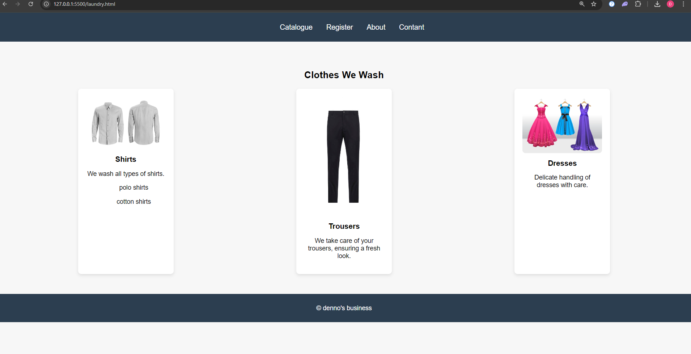
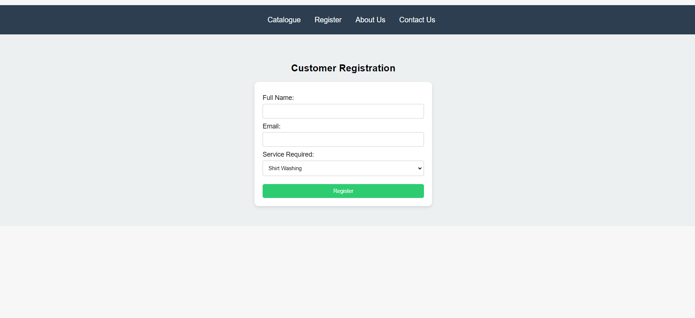
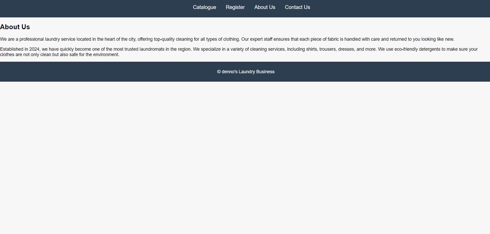
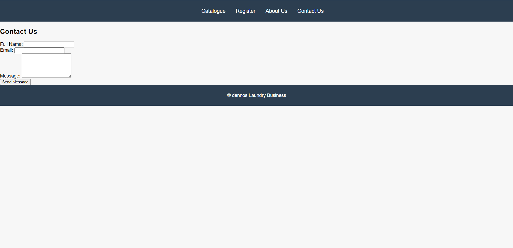

# Laundry Business Website
https://github.com/DennisMuthama/CIT-227-075-2022
Project Overview
This project is a simple laundry business website created using HTML, CSS, and JavaScript. The website showcases the services offered by the laundry business, provides a catalog of clothing items that can be washed, and includes both a customer registration form and a contact form.

## The website consists of 5 pages:

Catalogue (laundry.html) - Contains the business catalogue 
register (laundryform.html)-a customer registration form.
About Us (about.html) - Provides information about the laundry business.
Contant Us (contant.html) - Allows customers to reach out using a contant form.
CSS (styles.css) - Contains the styles for the entire website.
JavaScript (script.js) - Handles form interactions and submission logic.

## Features
Navigation Bar: A menu that allows users to navigate between the different pages of the website.
Catalogue Section: A display of different types of clothes the laundry business can handle, such as shirts, trousers, and dresses.
Customer Registration Form: A form for customers to register for laundry services by entering their name, email, and service of interest.
Contact Form: A contact form on the Contact Us page that allows customers to send messages directly to the business.
Responsive Design: The website layout is responsive and adapts to different screen sizes.
Simple Form Validation: The JavaScript file contains basic validation logic for both the registration form and the contact form.  

## homepage layout

## registration page

## about page 

## contant page 
